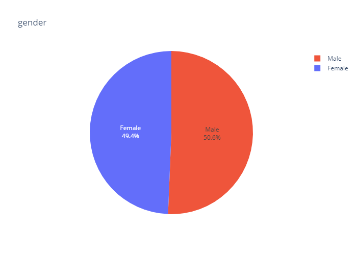
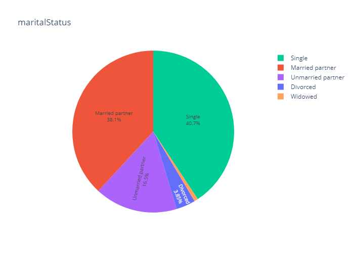
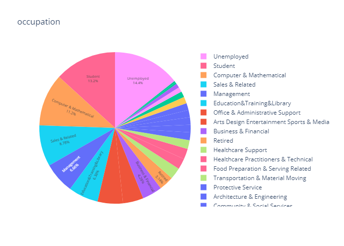
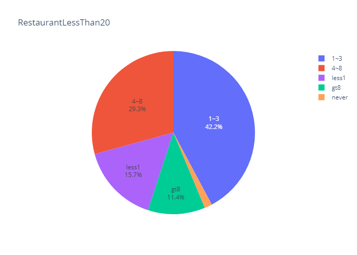
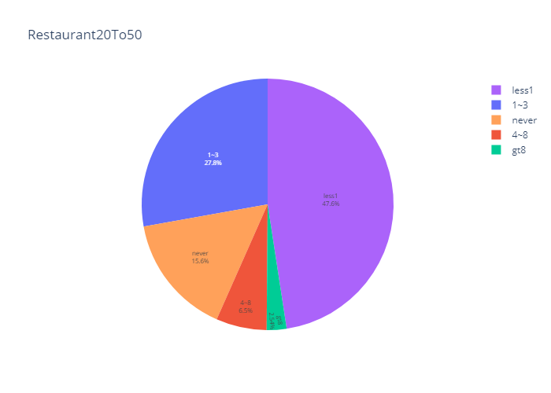
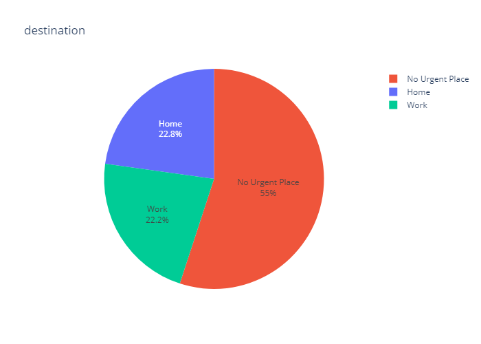
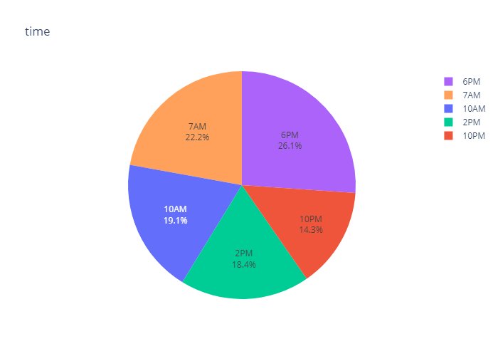
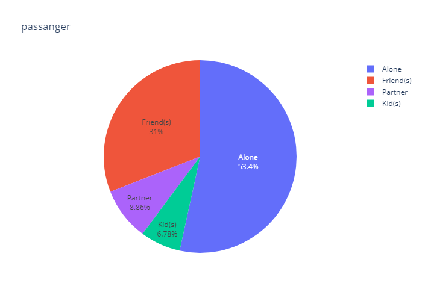

# ML-App1
<h1>“Will a customer accept the coupon?”</h1>

<h2>Observations</h2>

1. User attributes
    -  Gender: male, female
       -  there is no real difference among genders of male vs female for coupon decisions
       -  

    -  Age: below 21, 21 to 25, 26 to 30, etc.
       -  from the pie chart, the groups of _**age under 30**_ make up ~50% of the coupon decisions. We should focus on targeting this group.
       -    
    -  
    -  Marital Status: single, married partner, unmarried partner, or widowed
        - there are no real difference among single vs married/unmarried partner in this decision making.
        -    
    -  Number of children: 0, 1, or more than 1
        - those who _**do not have children**_ are more sensitive to buying coupons.
        -    
    -  Education: high school, bachelors degree, associates degree, or graduate degree
        - those who have bachelor degrees or still in colleges made up the majority of the coupon usage.
        -    
    -  Occupation: architecture & engineering, business & financial, etc.
        - out of those occupations, _**umemployed and students**_ are the most price sensitive and thus willing to buy coupons. Interestingly, maths and computer scientists are among the top 3, explaining that digital coupons have higher reach to those who are tech savvy.
        -    
    -  Annual income: less than \\$12500, \\$12500 - \\$24999, \\$25000 - \\$37499, etc.
       -  income range category shows an obvious price sensitivity for those who want coupons. Users who have _**income less than $50k**_ are willing to accept coupons than others who have higher incomes.
        -    
    -  Number of times that he/she goes to a bar: 0, less than 1, 1 to 3, 4 to 8 or greater than 8
        - those who _**has been to the bars at least once a month**_ tend to have higher acceptance rate than those who never goes to the bar, even though those who never goes to the bar make up the largest proportions out of the categories.
        -    
    -  Number of times that he/she buys takeaway food: 0, less than 1, 1 to 3, 4 to 8 or greater than 8
       -  Those who do take away foods are more exposed to those who never takes away food, thus the acceptance rate among the take aways are higher. The highest is among those who do _**1-3 takeaways**_.
        -  
    -  Number of times that he/she goes to a coffee house: 0, less than 1, 1 to 3, 4 to 8 or greater than 8
       -  Those who go to the Coffee house 1-3 times per week are more willing to accept the coupons (the highest acceptance rate)
        -  
    -  Number of times that he/she eats at a restaurant with average expense less than \\$20 per person: 0, less than 1, 1 to 3, 4 to 8 or greater than 8
        - for those who _**goes to cheap restaurants**_, they are willing to accept coupons than those who have not. As compared to medium priced restaurant charts, the ones who go to those restaurants less than or equal to 1 times have higher acceptance rates.
        -  
        -  

2. Contextual attributes
    - Driving destination: home, work, or no urgent destination
        - those who _**have no urgent destinations**_ or "free" minds tend to be more willing to accept coupons than those who are going to work or going home.
        -  
    - Location of user, coupon and destination: we provide a map to show the geographical location of the user, destination, and the venue, and we mark the distance between each two places with time of driving. The user can see whether the venue is in the same direction as the destination.
    
    - Weather: sunny, rainy, or snowy and Temperature: 30F, 55F, or 80F
        - Of course, on a _**nice sunny day**_ and _**80F**_, people want to accept coupons!
        -  
    - Time: 10AM, 2PM, or 6PM
        - There is no real thing we can conclude from the time that affects coupon acceptance rates
        -  
    - Passenger: alone, partner, kid(s), or friend(s)
        - Those drivers who are alone seems to be proned to accept coupons more!
        -      
        -  
3. Coupon attributes
    - time before it expires: 2 hours or one day
        - users tend to accept coupons in **1 day expirations** rather than 2hour expirations
        -  
     - coupon acceptance places
       - 

<h2>Analysis</h2>

So users who tend to have higher coupon acceptance rates are:
- under 30 years old, do not have children
- more price-sensitive such as: income below $50k, are unemployed or still in school, go to cheap restaurants often (more than 1 times per week)
- have no urgency or free of mind when accepting coupons: drivers who travel alone or with friends, on a sunny day at 80F, coupon expiration is next day